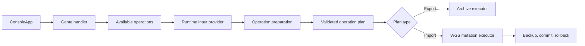

# Game-Specific Save Operations Implementation Plan

## Objective

Refactor XgpSaveTools so game handlers can expose explicit, game-specific operations with runtime inputs, reversible transformations, validation, and safe WGS mutations.

The first full implementation will add bidirectional support for DOOM: The Dark Ages, then reuse the same idTech operation layer for DOOM Eternal:

- Xbox/Game Pass to Steam export
- Steam to Xbox/Game Pass import into an existing WGS slot

The refactor must also prevent transformed export artifacts from being treated as writable WGS entries, which is currently unsafe for handlers such as Starfield, Persona 3 Reload, Control, and One Lonely Outpost.

## Goals

- Separate logical save operations from WGS repository access.
- Let each game advertise only the operations it actually supports.
- Support operation-specific runtime parameters such as SteamID64, input directories, target slots, and optional profile handling.
- Keep console prompting outside the core library.
- Prepare and validate all transformed files before modifying WGS.
- Treat multi-file imports as one operation.
- Back up and recover from failed WGS mutations.
- Preserve existing extraction behavior during migration.
- Keep `games.json` as the game-to-handler registry.

## Non-Goals

- Creating new WGS containers or modifying `containers.index` in the initial implementation.
- Automatically discovering every storefront account or save location.
- Making every existing transformed handler bidirectional during this refactor.
- Replacing the current console application with a dependency-injection framework.
- Editing DOOM save payload contents beyond encryption, decryption, and required checksum generation.

## Current Architecture Problems

### Export artifacts and WGS entries are conflated

`SaveFile` contains a `ContainerEntry`, and replacement assumes its path is a real WGS blob. Transformed handlers instead return temporary or synthetic paths. This makes replacement incorrect or unsafe for handlers that reconstruct, encrypt, decrypt, or synthesize files.

Examples include:

- Starfield reconstructing one save from multiple WGS blobs.
- Persona 3 Reload producing encrypted temporary files.
- Control creating a synthetic display-name file.
- One Lonely Outpost expanding a compressed JSON archive into multiple files.

### Handler capabilities are implicit

`ISaveHandler` exposes only `GetSaveEntries`. The application cannot distinguish between:

- Direct WGS entry mapping
- Export-only transformation
- Reversible transformation
- Multi-file atomic import
- Game-specific operation

### Runtime parameters have no model

Static `handler_args` work for fixed configuration, but not for per-operation values such as:

- SteamID64
- Source save directory
- Target WGS slot
- Whether to include or replace a profile

### Replacement is file-by-file

Some games require related files to be replaced together. DOOM requires four payload files and two generated XGP checksum entries to be committed as one logical operation.

## Target Architecture

The architecture will have four distinct responsibilities:

1. **Handler:** advertises game-specific operations.
2. **Input provider:** collects runtime operation parameters.
3. **Operation:** prepares and validates an immutable execution plan.
4. **Executor:** performs exports or controlled WGS mutations.



## Proposed Core Contracts

Names may be adjusted during implementation, but the separation of responsibilities should remain.

### Game context

```csharp
public sealed record GameSaveContext(
    GameInfo Game,
    UserContainerFolder UserContainer,
    string StorePackage,
    IReadOnlyList<ContainerMetaFile> Containers);
```

The context is constructed once after selecting a game and user container. It contains parsed WGS metadata but performs no mutations.

### Handler

```csharp
public interface IGameSaveHandler
{
    string Id { get; }

    IReadOnlyList<IGameSaveOperation> GetOperations(
        GameSaveContext context);
}
```

The operation list is the handler's capability declaration. Unsupported operations are not shown in the UI.

### Operation

```csharp
public interface IGameSaveOperation
{
    OperationDefinition Definition { get; }

    IReadOnlyList<OperationParameter> GetParameters(
        GameSaveContext context);

    Task<OperationPlan> PrepareAsync(
        GameSaveContext context,
        OperationArguments arguments,
        ITempWorkspace workspace,
        CancellationToken cancellationToken);
}
```

`PrepareAsync` may write only to its temporary workspace. It must not modify WGS or final export locations.

### Operation definition

```csharp
public sealed record OperationDefinition(
    string Id,
    string DisplayName,
    string Description,
    OperationKind Kind);

public enum OperationKind
{
    Export,
    Import,
    Maintenance
}
```

### Runtime parameters

Start with the parameter types needed by the current CLI:

- `TextParameter`
- `FileParameter`
- `DirectoryParameter`
- `ChoiceParameter`
- `BooleanParameter`

Each parameter should provide:

- Stable key
- User-facing label and optional description
- Required/default value information
- Validation
- Dynamic choices when the values depend on `GameSaveContext`

```csharp
public abstract record OperationParameter(
    string Key,
    string Label,
    bool Required);

public sealed record OperationArguments(
    IReadOnlyDictionary<string, object?> Values);
```

Typed argument accessors should produce useful errors rather than exposing dictionary casts throughout handlers.

### Input provider

```csharp
public interface IOperationInputProvider
{
    Task<OperationArguments?> CollectAsync(
        IReadOnlyList<OperationParameter> parameters,
        CancellationToken cancellationToken);
}
```

The console implementation belongs in `Xgpst-ConsoleApp` and uses `ConsoleHelper`. Tests can use a dictionary-backed implementation. A future noninteractive CLI can populate the same argument model from command-line options.

Core handlers must not call `Console.ReadLine`, write menus, or depend on `ConsoleHelper`.

## Operation Plans

Export and import plans should be separate types so import targets cannot be confused with export artifacts.

```csharp
public abstract record OperationPlan;

public sealed record ExportPlan(
    IReadOnlyList<ExportArtifact> Files,
    string SuggestedArchiveName)
    : OperationPlan;

public sealed record ExportArtifact(
    string OutputName,
    string PreparedFile);

public sealed record WgsEntryKey(
    string ContainerName,
    string FileName);

public abstract record PlannedWgsMutation(WgsEntryKey Target);

public sealed record PlannedReplacement(
    WgsEntryKey Target,
    string PreparedFile)
    : PlannedWgsMutation(Target);

public sealed record PlannedDeletion(
    WgsEntryKey Target,
    bool DeleteContainerFolder = false)
    : PlannedWgsMutation(Target);

public sealed record ImportPlan(
    IReadOnlyList<PlannedWgsMutation> Mutations,
    IReadOnlyList<string> Warnings)
    : OperationPlan;
```

Use stable logical WGS keys rather than persisting physical blob paths in plans. The executor resolves the current path immediately before commit and fails if the target is missing or ambiguous.

## Executors

### Export executor

Responsibilities:

- Validate output names against absolute paths and path traversal.
- Reject duplicate output names.
- Create the ZIP archive.
- Copy prepared artifacts into the archive.
- Clean the temporary workspace after completion or failure.

### WGS mutation executor

Responsibilities:

1. Ensure the game/user container still matches the prepared context.
2. Resolve every `WgsEntryKey` before writing anything.
3. Reject missing, duplicate, or out-of-scope targets.
4. Ensure every prepared replacement file exists and is readable.
5. Display warnings and a complete change summary.
6. Require user confirmation.
7. Back up the complete user WGS directory.
8. Stage replacement files on the same filesystem when possible.
9. Commit every replacement.
10. Restore the backup or original files if a commit fails.
11. Clean temporary and staged files.

The handler prepares content; only the executor is authorized to mutate WGS.

## Generic and Legacy Operations

### Generic raw export

The generic handler should expose an operation that exports the WGS files using their current logical names. This replaces the current direct call to `GetSaveEntries`.

### Direct entry replacement

Raw per-entry replacement may remain available only when an operation explicitly returns real WGS targets without transformation. It must not be inferred from an export artifact's source path.

### Legacy adapter

To keep the migration incremental, create a temporary adapter that wraps existing `ISaveHandler.GetSaveEntries` as an export-only operation.

The adapter must never advertise replacement. Mapping-only handlers can later move to a reusable mapped operation that explicitly defines both export artifacts and import targets.

## DOOM: The Dark Ages Handler

### Registration

Add the game to `games.json` with:

```jsonc
{
  "name": "DOOM: The Dark Ages",
  "package": "BethesdaSoftworks.ProjectTitan_3275kfvn8vcwc",
  "handler": "doom-dark-ages"
}
```

### Shared services

Implement small, testable services under a game-specific or idTech-specific namespace.

#### Steam save cryptography

For each file:

```text
material = ASCII(SteamID64 + "MANCUBUS" + filename)
key      = first 16 bytes of SHA256(material)
AAD      = material
output   = 12-byte nonce + AES-128-GCM ciphertext + 16-byte tag
```

Requirements:

- Use a cryptographically secure random nonce for encryption.
- Require a 16-byte authentication tag.
- Reject authentication failures during decryption.
- Use the leaf filename exactly, including `-BACKUP`.
- Validate SteamID64 as a 17-digit numeric identifier.
- Keep cryptographic methods independent of filesystem access where practical.

#### XGP duration checksum

The two XGP `.checksum` files contain idTech's `MD5_BlockChecksum` as an eight-byte little-endian value:

1. Compute the 16-byte MD5 digest of the raw duration payload.
2. Interpret it as four little-endian `UInt32` values.
3. XOR the four values.
4. Write the result as a little-endian `UInt64`; the upper 32 bits are zero.

Verified sample values:

```text
game_duration.dat
checksum = 0x67950EBF
bytes    = BF 0E 95 67 00 00 00 00

game_duration.dat-BACKUP
checksum = 0x655AD541
bytes    = 41 D5 5A 65 00 00 00 00
```

### Export to Steam operation

#### Parameters

- Target SteamID64
- XGP slots to export, defaulting to all `GAME-AUTOSAVE*` containers
- Include profile, default `false`

#### Preparation

For every selected autosave container:

1. Require the expected payload files.
2. Ignore XGP `.checksum` sidecars.
3. Encrypt each Steam-compatible file using the target SteamID64.
4. Preserve the `GAME-AUTOSAVE*/filename` layout.
5. Optionally encrypt `PROFILE/profile.bin` when explicitly requested.
6. Return an `ExportPlan`.

Expected autosave files:

- `game.details`
- `game.details-BACKUP`
- `game_duration.dat`
- `game_duration.dat-BACKUP`

Profile export should remain an advanced option because it may carry platform-specific settings, account state, and entitlements.

### Import from Steam operation

#### Parameters

- Steam save directory
- Source SteamID64
- Target existing XGP `GAME-AUTOSAVE*` slot
- Replace profile, default `false`

#### Preparation

1. Resolve the four required Steam autosave files.
2. Reject duplicate or unexpected path mappings.
3. Decrypt each file using its exact leaf filename.
4. Validate the decrypted payloads:
   - `game.details` is readable and contains expected descriptor keys.
   - `game_duration.dat` has the expected idTech/`SlotFile` structure.
   - Backups pass equivalent basic validation.
5. Preserve the decrypted `game.details` checksum field unchanged.
6. Generate current and backup XGP checksum sidecars from the decrypted duration files.
7. Resolve all six required WGS targets in the selected container.
8. Return one `ImportPlan` containing all six replacements.

Required replacements:

| WGS logical entry | Prepared content |
|---|---|
| `game.details` | Decrypted Steam details |
| `game.details-BACKUP` | Decrypted Steam details backup |
| `game_duration.dat` | Decrypted Steam duration |
| `game_duration.dat-BACKUP` | Decrypted Steam duration backup |
| `game_duration.dat.checksum` | Generated current checksum |
| `game_duration.dat-BACKUP.checksum` | Generated backup checksum |

The six files are one atomic unit. The UI must not allow partial selection.

### Existing-slot limitation

The initial importer can only target an existing XGP slot because creating WGS entries and updating `containers.index` are not implemented. Users must start the XGP version and create the desired slot before importing.

### Profile policy

Keep the existing XGP profile by default. Profile conversion should be implemented as a separate advanced path or follow-up operation after it has dedicated in-game validation.

## DOOM Eternal Extension

DOOM Eternal uses the same Steam `MANCUBUS` AES-GCM scheme and the same four core save-slot payloads. Its handler is a thin configuration over the shared DOOM idTech handler rather than a copy of the Dark Ages operations.

- Register `BethesdaSoftworks.DOOMEternal-PC_3275kfvn8vcwc` with handler ID `doom-eternal`.
- Detect compatible slots by the presence of all four required payloads, covering `GAME-AUTOSAVE*`, `DLC1-AUTOSAVE*`, `DLC2-AUTOSAVE*`, and `HORDE-AUTOSAVE*` without hard-coding those names.
- Preserve the discovered container name as the Steam output folder name.
- Generate duration checksum sidecars only when those entries exist in the Eternal XGP target. Dark Ages continues to require both sidecars.
- Keep profile conversion opt-in and experimental.
- Treat Eternal support as provisional until a real XGP/Steam sample pair and an in-game load test are available.

## Console Application Flow

Replace the fixed operation menu with handler-provided operations:

1. Select game.
2. Select user WGS container.
3. Build `GameSaveContext`.
4. Resolve `IGameSaveHandler`.
5. Display its available operations.
6. Collect the selected operation's parameters.
7. Prepare the operation plan.
8. Display the plan summary and warnings.
9. Execute or cancel.

The console should retain universal actions such as opening the WGS directory, but export/import choices should come from the handler.

## Suggested Project Layout

```text
XgpSaveTools/
  Operations/
    IGameSaveHandler.cs
    IGameSaveOperation.cs
    OperationDefinition.cs
    OperationParameters.cs
    OperationArguments.cs
    OperationPlans.cs
    OperationExecutor.cs
    TempWorkspace.cs
    LegacySaveHandlerAdapter.cs
  SaveHandlers/
    Impl/
      DoomDarkAges/
        DoomDarkAgesHandler.cs
        ExportToSteamOperation.cs
        ImportFromSteamOperation.cs
        IdTechSteamSaveCrypto.cs
        IdTechBlockChecksum.cs

Xgpst-ConsoleApp/
  Operations/
    ConsoleOperationInputProvider.cs
    ConsoleOperationPresenter.cs
```

## Migration Plan

### Phase 1: Introduce operation primitives

- [x] Add `GameSaveContext`.
- [x] Add operation definitions, parameters, arguments, and plans.
- [x] Add temporary-workspace abstraction.
- [x] Add export and WGS mutation executors.
- [x] Add unit tests for parameter validation and target resolution.

Exit criteria:

- Operation preparation can be tested without console interaction.
- An import plan cannot modify WGS directly.
- Export artifacts and WGS targets are distinct types.

### Phase 2: Integrate the console

- [x] Implement `ConsoleOperationInputProvider` using `ConsoleHelper`.
- [x] Display handler-provided operations in `ConsoleApp`.
- [x] Display plan summaries and warnings.
- [x] Add confirmation before WGS mutations.
- [x] Keep `Open Directory` as a universal action.

Exit criteria:

- The console can run an operation without game-specific prompt code.
- Cancellation at any prompt produces no mutations.

### Phase 3: Preserve existing extraction

- [x] Add a legacy export-only adapter for existing `ISaveHandler` implementations.
- [x] Route existing extraction through `ExportPlan` and the export executor.
- [x] Remove replacement choices derived from exported `SaveFile` objects.
- [x] Confirm existing game extraction tests still pass.

Exit criteria:

- Existing extraction behavior remains available.
- Transformed handlers no longer expose unsafe replacement targets.

### Phase 4: Add DOOM shared primitives

- [x] Implement AES-GCM encrypt/decrypt helper.
- [x] Implement SteamID64 validation.
- [x] Implement `MD5_BlockChecksum` helper.
- [x] Add known-vector and round-trip tests.
- [ ] Add checksum tests using both supplied sample pairs.

Exit criteria:

- The published encryption test vector passes.
- Encrypt/decrypt round trips all four supplied raw autosave files.
- Generated checksum sidecars match the supplied XGP files byte-for-byte.

### Phase 5: Implement DOOM export

- [x] Add DOOM game registration.
- [x] Add `DoomDarkAgesHandler`.
- [x] Add target SteamID64 prompt definition.
- [x] Preserve slot folder layout.
- [x] Exclude XGP checksum sidecars.
- [x] Keep profile export disabled by default.
- [x] Add export-plan tests.

Exit criteria:

- Exported encrypted files have a 28-byte overhead.
- Decrypting an exported file reproduces the original XGP payload.
- The ZIP layout matches Steam's `remote/GAME-AUTOSAVE*` layout.

### Phase 6: Implement DOOM import

- [x] Add source directory, source SteamID64, and target slot parameters.
- [x] Decrypt and validate all required files before planning writes.
- [x] Generate both XGP checksum sidecars.
- [x] Produce a six-file atomic `ImportPlan`.
- [ ] Add missing-target and corrupted-input tests.
- [x] Add rollback tests using a temporary WGS fixture.

Exit criteria:

- No WGS file changes when preparation or validation fails.
- A successful plan always contains exactly the six required replacements.
- Commit failure restores the original fixture.

### Phase 6b: Extend the shared handler to DOOM Eternal

- [x] Generalize slot discovery around the four required idTech payloads.
- [x] Register the `doom-eternal` handler.
- [x] Cover base-game and DLC/Horde-style slot names without a fixed prefix requirement.
- [x] Make Eternal checksum regeneration conditional on the target WGS entries.
- [x] Add export/import plan tests for an Eternal DLC slot without checksum sidecars.
- [ ] Validate both directions using a real Eternal XGP/Steam sample pair.
- [ ] Load converted saves in both game builds.

### Phase 7: Manual game validation

- [ ] Test XGP to Steam using a newly created Steam slot.
- [ ] Test Steam to XGP using a newly created XGP target slot.
- [ ] Test current and backup loading behavior.
- [ ] Verify save progression, chapter state, and collectibles.
- [ ] Verify cloud clients do not overwrite the imported save during the test.
- [ ] Repeat with compatible current game builds.
- [ ] Document the user workflow and recovery procedure.

Exit criteria:

- Both directions load without a corruption warning.
- The expected campaign state is present.
- The original saves can be restored from backups.

### Phase 8: Complete migration

- [ ] Convert mapping-only handlers to reusable mapped operations.
- [ ] Mark transformed handlers export-only until imports exist.
- [ ] Add reverse operations where practical.
- [ ] Remove `ISaveHandler` and the legacy adapter.
- [ ] Replace `SaveFile` with operation-specific artifact and target types.
- [ ] Update README extensibility documentation.

## Existing Handler Classification

Initial classification for migration planning:

### Primarily mapping and renaming

- Generic handlers
- Arcade Paradise
- Coral Island
- Cricket 24
- Forza
- Lies of P
- Like a Dragon
- Palworld
- Railway Empire 2
- Scorn
- State of Decay 2

These can move to reusable mapped export operations. Reverse replacement still needs to be explicitly enabled rather than inferred.

### Transforming or synthetic

- Starfield
- Persona 3 Reload
- One Lonely Outpost
- Control

These should initially advertise export only. Their current temporary artifacts must never be treated as WGS mutation targets.

## Testing Strategy

### Unit tests

- Operation parameter validation
- Typed argument retrieval
- SteamID64 validation
- AES-GCM known vector
- AES-GCM authentication failure
- Encryption/decryption round trip
- `MD5_BlockChecksum` known vectors
- WGS key resolution
- Duplicate target rejection
- Output path traversal rejection

### Plan tests

- DOOM export includes expected files and excludes checksum sidecars.
- DOOM import creates exactly six replacements.
- DOOM import never replaces `PROFILE` by default.
- Missing backup files produce a clear validation error.
- Invalid SteamID64 fails before file transformation.
- Incorrect SteamID64 fails AES-GCM authentication.
- Missing XGP target entries fail before backup or commit.

### Executor integration tests

- Export ZIP creation
- Backup creation before mutation
- Successful multi-file commit
- Failure during commit restores originals
- Cancellation before confirmation leaves WGS unchanged
- Temporary workspace cleanup after success and failure

### Manual tests

- Close the game before any mutation.
- Disable or control Steam/Xbox cloud synchronization.
- Use disposable test slots.
- Verify both current and backup files.
- Restore from the tool-generated backup after each scenario.

## Safety and Validation Requirements

- Never mutate `containers.index` in the initial implementation.
- Never add or delete WGS entries during a game-specific import.
- Never allow an import target outside the selected user WGS directory.
- Reject absolute and traversal paths in export artifact names.
- Validate every target and prepared file before backup and commit.
- Back up before the first mutation.
- Treat authentication failures as incorrect input, not as recoverable plaintext.
- Do not log cryptographic payloads or full save contents.
- SteamID64 is not a secret, but avoid persisting it unless the user explicitly requests configuration storage.
- Warn when source and target game versions may be incompatible.
- Default all profile replacement options to `false`.

## Documentation Deliverables

- Architecture and handler extensibility section in `README.md`.
- Operation authoring example.
- DOOM XGP-to-Steam instructions.
- DOOM Steam-to-XGP instructions.
- Existing-slot requirement.
- SteamID64 explanation.
- Cloud synchronization warning.
- Backup and recovery instructions.

## Definition of Done

The work is complete when:

- Handlers advertise explicit operations and runtime parameter definitions.
- Core handlers contain no console prompting.
- Export artifacts cannot be mistaken for WGS targets.
- Unsupported replacement operations are not shown.
- DOOM XGP-to-Steam export passes automated and manual validation.
- DOOM Steam-to-XGP import replaces an existing slot successfully.
- DOOM checksum files are generated deterministically and correctly.
- Multi-file WGS imports are backed up, validated, and recoverable.
- Existing supported-game extraction remains functional.
- The new architecture and DOOM workflows are documented.
