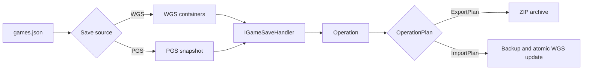

# 🎮 XGP‑Save‑Tools 🎮

A .NET CLI for extracting and replacing Xbox PC saves, based on [XGP-save-extractor](https://github.com/Z1ni/XGP-save-extractor).
It supports legacy WGS containers, file-oriented PGS saves, and game-specific conversion logic.

- Generic WGS extraction and direct-entry replacement
- Consistent PGS snapshot backup and file extraction
- Game-specific export/import operations
- Automatic backups and rollback for multi-file replacements
---

## Requirements

- **.NET 6 runtime** (recent releases are self-contained)
- Windows 10/11

## How to use

### Extract saves

1. Select a game or enter a custom `wgs` directory.
2. Select the user container.
3. Choose **Extract Files**.
4. Confirm the plan to create a ZIP archive.


### Replace a save entry

1. Choose **Replace Entry**.
2. Select the WGS entry and replacement file.
3. Review and confirm the plan.
4. The tool creates a complete backup before writing.


> **Caution:** Not every entry is a save slot. Keep the generated backup until the game has loaded successfully.

### PGS saves

Newer games can store their saves under `%SystemDrive%\XboxGames\GameSave\pgs` instead of a package's `SystemAppData\wgs` directory. The tool discovers these saves by PGS game ID and resolves the active `current` snapshot.

PGS games provide two operations:

- **Export Complete PGS Backup** includes the active snapshot, PGS metadata, and a SHA-256 integrity manifest.
- **Extract Game Files** exports only the untouched `ContainersRoot` file tree.

## Build and installation

Download the latest release from [GitHub Releases](https://github.com/brodrigz/XgpSaveTools/releases/latest), or publish it locally:

```bash
dotnet publish Xgpst-ConsoleApp/Xgpst-ConsoleApp.csproj \
  -c Release \
  -r win-x64 \
  --self-contained false \
  /p:PublishSingleFile=true \
  --output bin/Release/net6.0/publish/win-x64
```

---

## Implementing new handlers

Most WGS games need no custom code. Register the package in [`games.json`](XgpSaveTools/games.json) and use a built-in mapping:

| Handler | Behavior |
|---|---|
| `generic` | Export every WGS entry using its stored filename |
| `1c1f` | Export the first file from each container |
| `1cnf` | Export every file from the first container |
| `1cnf-folder` | Export containers as folders |

```json
{
  "name": "Example Game",
  "package": "Publisher.ExampleGame_abc123",
  "handler": "1c1f",
  "handler_args": { "suffix": ".sav" }
}
```

`source` defaults to `wgs`. For a file-oriented PGS game, register its PGS game ID separately from handler arguments:

```json
{
  "name": "Example PGS Game",
  "package": "Publisher.ExampleGame_abc123",
  "source": "pgs",
  "source_args": { "game_id": "ABC123" },
  "handler": "pgs-files"
}
```

`pgs-files` provides complete backup and raw `ContainersRoot` extraction without custom code. Add a game-specific handler only when those files need filtering or transformation. Storage discovery belongs in a save source; game-format logic belongs in a handler.

### Adding custom logic

Custom handlers follow one simple flow:



Implement `IGameSaveHandler`, expose the operations your game supports, and prepare a plan:

```csharp
public sealed class ExampleHandler : IGameSaveHandler
{
    public const string HandlerId = "example";
    public string Id => HandlerId;

    public IReadOnlyList<IGameSaveOperation> GetOperations(GameSaveContext context) =>
        new IGameSaveOperation[] { new ExportOperation() };

    private sealed class ExportOperation : IGameSaveOperation
    {
        public OperationDefinition Definition { get; } = new(
            "export", "Export", "Convert this save.", OperationKind.Export);

        public IReadOnlyList<OperationParameter> GetParameters(GameSaveContext context) =>
            new OperationParameter[]
            {
                new TextParameter("account-id", "Target account ID")
            };

        public Task<OperationPlan> PrepareAsync(
            GameSaveContext context,
            OperationArguments arguments,
            ITempWorkspace workspace,
            CancellationToken cancellationToken)
        {
            arguments.Validate(GetParameters(context));
            var accountId = arguments.GetRequiredString("account-id");
            var source = context.Containers.First().Files.First();
            var output = workspace.GetPath("save.dat");

            File.Copy(source.Path, output); // Apply the game-specific conversion here.

            return Task.FromResult<OperationPlan>(new ExportPlan(
                new[] { new ExportArtifact("save.dat", output) },
                "example-save.zip"));
        }
    }
}
```

Prompts are declared with `TextParameter`, `FileParameter`, `DirectoryParameter`, `ChoiceParameter`, or `BooleanParameter`. The console collects them automatically—handlers should not call `Console`.

For imports, prepare every replacement in `ITempWorkspace` and return a single atomic `ImportPlan`:

```csharp
return new ImportPlan(
    new PlannedWgsMutation[]
    {
        new PlannedReplacement(
            new WgsEntryKey("TARGET-SLOT", "save.dat"),
            preparedFile)
    },
    new[] { "Close the game before continuing." });
```

Finally:

1. Add `"handler": "example"` to the game in `games.json`.
2. Add `[ExampleHandler.HandlerId] = new ExampleHandler()` to [`GameSaveHandlerRegistry.cs`](XgpSaveTools/SaveHandlers/GameSaveHandlerRegistry.cs).
3. Add plan tests for the output files and WGS targets.

For export-only transformations without prompts, inherit `ExportOnlyGameSaveHandler`. For filename changes without transformations, add a `MappedSaveEntry` function to [`StandardGameMappings.cs`](XgpSaveTools/SaveHandlers/StandardGameMappings.cs).

Keep these rules in mind:

- Never modify WGS in `PrepareAsync`; only return a plan.
- Write transformed files inside `ITempWorkspace`.
- Put related replacements in one `ImportPlan` so backup and rollback cover everything.
- For PGS handlers, read `context.PgsSnapshot.Files`; do not parse or rewrite Gaming Services metadata in the handler.
- PGS imports are intentionally unavailable until the source can perform a safe cloud-aware transaction.

See [`DoomDarkAgesHandler.cs`](XgpSaveTools/SaveHandlers/Impl/DoomDarkAges/DoomDarkAgesHandler.cs) for a complete bidirectional example.

---

## Acknowledgments and contributions

- Port inspired by [Z1ni’s XGP-save-extractor](https://github.com/Z1ni/XGP-save-extractor).
- [@snoozbuster](https://github.com/snoozbuster) for reverse engineering the container format.
- [@mi5hmash](https://github.com/mi5hmash/idSaveDataResigner) for documenting the idTech Steam save encryption scheme.
- [id Software's DOOM 3 BFG source](https://github.com/id-Software/DOOM-3-BFG/blob/master/neo/idlib/hashing/MD5.cpp) for the `MD5_BlockChecksum` reference.
- Contributions are welcome. Include the game package name and representative save samples with new handler requests.
